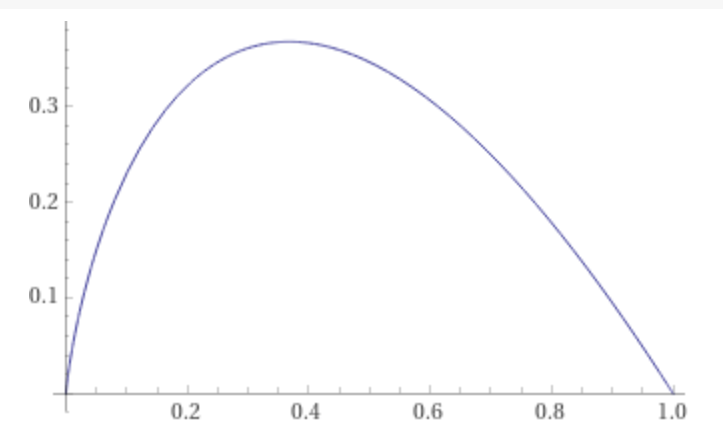

## Hidden Amongst The Disorder

The 2017 StackExchange developer's survey includes a staggering 154 possible features.  Selecting a small focused group for further analysis requires figuring out which features are relevant and which are just going to pollute your model.

There are a variety of tools available, but I find Shannon entropy to be particularly fascinating.  My training is in physics so I am familiar with the log(N) formulation of entropy from Statistical Mechanics.  To me the Shannon entropy, with its log(1/p), looks very familiar.

What Shannon provided was a definition for entropy in communication channels and a formula for computing it.  

H = - \sum_i p_i log(p_i)

Here H is the symbol for the entropy and p_i is the probability of the i-th outcome.  We sum over all possible outcomes to compute the entropy.

By itself Shannon's discovery doesn't provide us much insight for feature selection.  What we really want is a metric for quantifying the degree of coincidence of two features in our dataset. Mutual information, an offshoot of Shannon entropy, provides just such a metric.

His seminal idea has seen application in a myriad of fields of which Data Science is just one.

### Intuitive?

The quantity -p log(p) = p log(1/p) is central to understanding Shannon entropy.  Recall that a probability, p, may only vary between 0 and 1.  At p = 1, log(p) -> 0 so the whole quantity goes to zero.  The situation at p = 0 is a little trickier because -log(p) -> \infinity there.  This divergence is countered by the leading p coefficient which goes to zero.  However only by evaluating the limit \lim_{p -> 0} p log(p) can we confirm that the quantity goes to zero here as well, as shown in the following plot.

What this contributes to our intuitive understanding ~~is that states with very low probability contribute little entropy just as states with very high probability also don't~~ of Shannon entropy is the notion that systems with large numbers of equally probable states have greater entropy than those with small numbers of extremal probability states.  A system with only one state with a probability of 1 has no entropy at all.  You always know what state it's going to be in.

### Where Does Shannon Entropy Come From?

Before we can describe how mutual information (MI) relates to Shannon entropy we must first address the counter-intuitive relationship between entropy and information; i.e. that they are equivalent.  This notion is inherited from statistical mechanics (Shannon entropy's forebearer) where entropy was first [[[identified]]].

In statistical mechanics a highly entropic state is a highly degenerate state.  Our state is considered highly degenerate because it is a member of a large family of states which all share some label, typically that they all represent a configuration of the system at the same temperature.  The larger the family, the greater the entropy.  In fact in statistical mechanics the entropy is proportional to log N where N is precisely the number of states in the family.

In statistical mechanics information is what is required to identify the current state of the system.  If that state lives in a particularly large family of similar states then we will need a lot of detail to distinguish it from its siblings.  Thus if our state is highly entropic then identifying it requires a great deal of information.  Because of this correspondence we treat entropy and information as equivalent.

At the risk of excessive simplification, to compute the Shannon entropy we replace the log N from statistical mechanics with a log(1/p), where p is the probability of the system being in our state.  To be precise we have some state that we denote x_i which occurs with probability p(x_i) = p_i.  Those same probabilities, p_i, enter in to the formula a second time via the expectation value of the entropy.

For any quantity, let's call it q(x), we compute its expectation value, E(q), using

E(q) = \sum_i p_i q(x_i)

which is simply the probability weighted average of q.  Choosing the quantity to be the entropy q(x_i) = log(1/p_i) results in the Shannon entropy, presented above.

### Towards Mutual Information

As discussed above, the Shannon entropy itself is not terribly useful for feature selection.  If we want to assess the relationship between two features in our dataset, X and Y, we had better compute our Shannon entropy using their joint distribution, p(x_i, y_j) = p_{i j}.  Inserting this probability into our Shannon entropy obtains our first guess at a joint entropy, what we'll call H(X, Y).

H(X, Y) = - \sum_{i j} p_{i j} log(p_{i j})

where the marginal probabilities can be computed by summing over the partner.

* p(x_i) = \sum_j p(x_i, x_j)
* p(y_j) = \sum_i p(x_i, x_j)

The last thing we need to do is to subtract off the contributions from each of the individual Shannon entropies.

MI = H(X,Y) - H(X) - H(Y) = - \sum_{i j} p_{i j} log(p_{i j}/p_i p_j)

The quantity that remains is immune to the distribution of each variable separately and instead only indicates the degree to which they are intertwined, i.e. it's exactly what we're looking for.

### Categorical vs. Quantitative Features

The key to evaluating the formula above is to estimate the joint probability function with a histogram; a histogram with an extra dimension, what we call a 2-D histogram.  As with any histogram ours has bins and each count in each bin represents a row in our dataset.  The difference is that instead of a line of bins we have a grid of them.  Our estimator for the probability associated with each is the usual E(p_{i j}) = n_{i j}/N where n_{i j} is the counts in bin {i, j} and N is the total number of counts in all the bins.

One of the great strengths of mutual information as a metric for quantifying feature relevance is that it can be computed on any variable that can be binned.  It treats categorical variables exactly the way it treats quantitative variables.

### Implementation

I implemented my code in Python using a Jupyter notebook.  I made heavy use of the pandas data analysis tool and the NumPy scientific computing package.  

NumPy actually includes a function called `histogram2d()` which generates 2-D histograms like the one we want.  I chose not to use histogram2d() and instead to implement my own because I anticipate the need for a more sophisticated approach to handling missing data (NaNs).  More on this in a future blog post!

This is a schematic version of my binning code for a 1-D histogram.

    srs = df.iloc[:, 0]
    index = srs.value_counts(bins=10, sort=False).index if \
        srs.dtype=='float' else srs.value_counts().index
    
    for rowIndex, row in df.iterrows()
        idx = index.get_loc(row.iloc[0])
        if idx not in range(n):
            continue
        hist[idx] += 1

The key to this code is the creation of the index on the second line.  An index allows you to perform a 'reverse lookup', taking a value and getting back the corresponding bin number.  That's exactly what the `index.get_loc()` function call does.  We store this bin number in the variable idx.  Finally all we have to do is to record the value by incrementing the appropriate bin in `hist` using `hist[idx] += 1`.  (Please note that `index` does not index the rows, only the bins in the histogram.)

`row.iloc[0]` just takes the first entry in the row, which is the value we want to bin.  (This code assumes that the data to be histogrammed is stored in the first column in the DataFrame.)

Some readers will be disturbed by the use of `value_counts()` to generate the index on the second line.  While it is possible to avoid the use of `value_counts()` by using a `dict` instead, in my experience this didn't add anything but unnecessary bulk to the code.  However `value_counts()` cannot replace our entire binning code since it can handle only a single dimension and we need two.

While we treat categorical and quantitative features nearly identically there is one difference.  In line 2 you will see that there are two versions of the call to `value_counts()'.  The biggest difference is whether we specify the number of bins or not.  For quantitative data there is no 'correct' number of bins so we arbitrarily fix it at 10.  While for categorical data each distinct response should be given it's own bin.  We use the data type as a proxy for the type of the feature to determine which code to invoke.

### Same Code, More Dimensions
Performing the same operation in two dimensions is fairly straightforward.  For this we need two of everything, especially two indices.  Thus our `index` variable becomes an `indices[]` array of two elements.  Likewise `idx` becomes `idxs[]` and `n` becomes `ns[]`.  Our code now looks like...

    for j in range(2):
        srs = df.iloc[:, j]
        indices[j] = \
            srs.value_counts(bins=10, sort=False).index \
            if srs.dtype=='float' else srs.value_counts().index
    
    for rowIndex, row in df.iterrows()
        idxs[0] = indices[0].get_loc(row.iloc[0])
        idxs[1] = indices[1].get_loc(row.iloc[1])
        if idxs[0] not in range(ns[0]) \
            or idxs[1] not in range(ns[1]):
            continue
        hist2d[idxs[0], idxs[1]] += 1

We construct the indices just as we did in the one dimensional case, one index for each feature.  We then perform our reverse lookup trick to get the two idx values.  These are the x and y coordinates that uniquely identify a single bin in our grid.  We increment that bin in the last line.  

Having binned our data we have done most of the heavy lifting but we still must compute the mutual information between the two features.  `hist2d` below is computed by the code above.

    total = hist2d.sum(axis=0).sum()
    px = hist2d.sum(axis=1)/total
    py = hist2d.sum(axis=0)/total
    pbar = np.outer(px, py)
    p = hist2d/total
    lgp = np.log2(p) - np.log2(pbar)
    return (p*lgp)[np.isfinite(lgp)].sum()

The first line just sums up to get the total number of counts, N.  In the second and third lines we calculate the marginal probabilities p(x_i) and p(y_j) from the joint distribution p(x_i, y_j).  The variable denoted `pbar` simply represents p(x_i) p(y_j).  The outer product gives us a two dimensional array.  

We can take the log in any base we desire, but the most common practice is to perform the logs base 2.  This allows us to interpret the results as the number of bits required to encode the feature, or pair of features.

If any of the bins contains zero counts we should expect a divergent mutual information.  The log of zero is negative infinity.  `np.isfinite(lgp)` is used as a boolean mask to eliminate these divergent terms.  This is legitimate because as we discussed above the combination -p log(p) goes to zero even though log(p) diverges.

### Assessing Mutual Information As A Practical Tool

The following plot shows a typical result of a computation of the MI for pairs selected from four features from the 2017 StackExchange Developer Survey dataset.  ~~Salary and JobSatisfaction are quantitative features while HomeRemote and Country are categorical.~~  JobSatisfaction is the respondent's rating between 1 and 10 and thus is treated as quantitative.  So is Salary which is in US dollars and is also represented by an integer.  The Country question asks the respondent to select their country of residence from a long list and is thus  categorical; a similar story for HomeRemote.

Our ultimate goal is to construct a model which will accurately predict the salary of the respondent.  Towards that end we wish to select those features which will provide the most influential inputs to our model.  Of the four candidates shown below the strongest off-diagonal MI score with Salary is for the Country feature.  Salary and Country share a strong MI score of 0.77, almost 1.0.  In contrast, both HomeRemote and JobSatisfaction appear to have negligible MI with Salary.

[[[The word "influence" suggests a causal connection which MI cannot address.]]]

### The Real Story

One problem I encountered is that my binning code is relatively slow and surely inefficient.  Computing the mutual information for four features took an uncomfortable several minutes on my aging MacBook Pro; about the same amount of time required to fit a linear model to all 150 some odd features in the data set.

On the other hand, fitting that linear model required replacing every categorical feature with a profusion of boolean dummy columns; one for every response.  

We used the coefficients from the linear model to judge how important each feature had been in predicting the response; ~~a somewhat circular argument.~~  In contrast, measuring the MI between any pair of features requires the addition of no dummy columns at all and the idea is to only include those features which we anticipate will be influential based on their MI scores.

Finally, in the absence of time restrictions I would love to have gone on to identify all the (pairs of) features in the data set with a significant MI.  Perhaps Salary isn't the most interesting feature to focus on.

And I fully intend to explore some novel approaches to handling NaNs.  It strikes me that a non-answer to a question contains nearly as much information as an answer.  A NaN represents a valid response and should be treated as such.  In the Shannon entropy context we have the opportunity to treat all variables as categorical and we can count NaNs by putting them in just another bin.

Whether either of these two approaches would lead to a marked improvement in real world modeling remains to be seen.

==========================================================

### Bibliography

1. [https://en.wikipedia.org/wiki/Mutual_information](https://en.wikipedia.org/wiki/Mutual_information)
2. [https://www.wolframalpha.com/input/?i=plot+-p+log+p+from+0+to+1](https://www.wolframalpha.com/input/?i=plot+-p+log+p+from+0+to+1)
3. [https://en.wikipedia.org/wiki/Entropy_(information_theory)](https://en.wikipedia.org/wiki/Entropy_(information_theory))
4. [https://amethix.com/entropy-in-machine-learning/](https://amethix.com/entropy-in-machine-learning/)
5. [https://www.quora.com/What-is-the-relationship-between-entropy-and-information](https://www.quora.com/What-is-the-relationship-between-entropy-and-information)